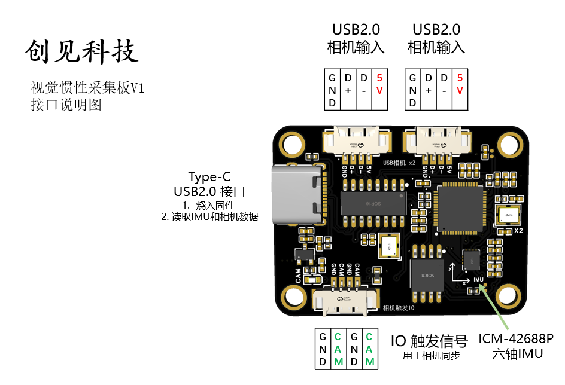
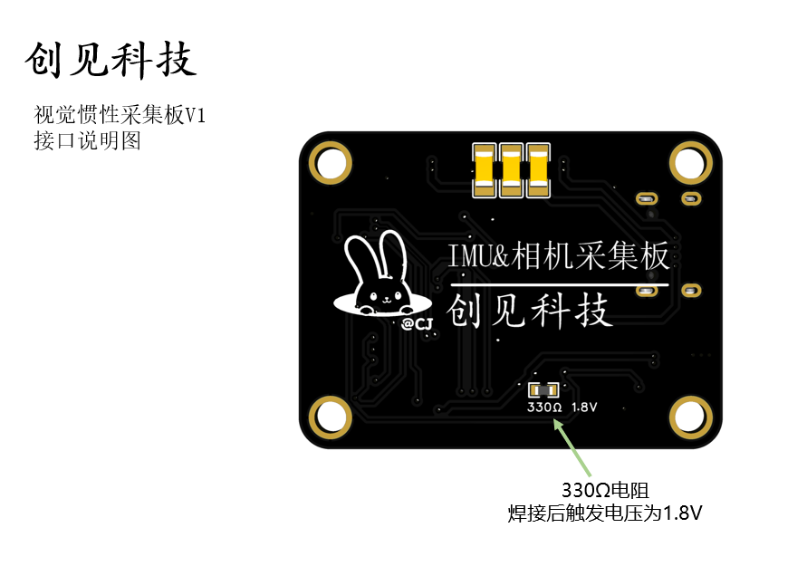
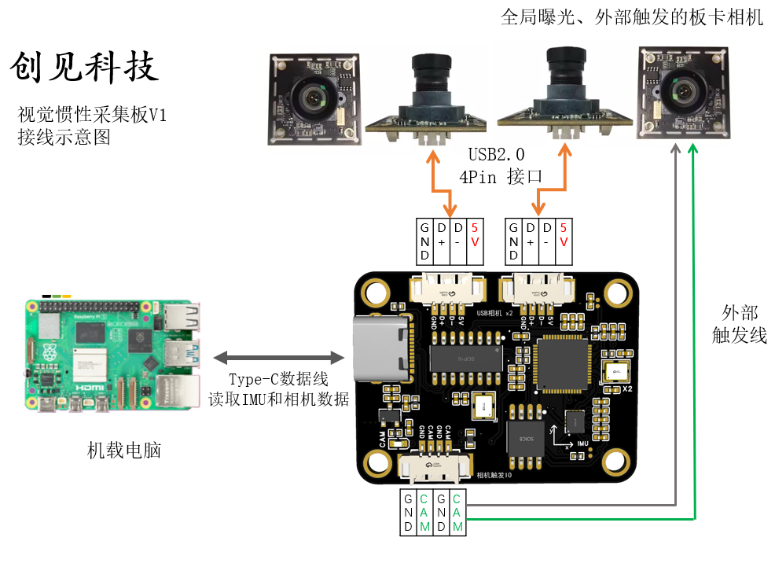

# 视觉惯性采集板

自定义一个能够运行VIO算法的设备并不是一件简单的事情，开发者首先面对的就是 (1) 相机快门类型的选择 (2) 相机和IMU的时间戳同步 (3) 视觉惯性外参标定，这三大问题。现有的设备提供了许多解决方案，然而往往难以在尺寸、灵活性和易用性上取得很好的平衡。成品的VIO设备不够灵活，无法自定义，工业相机搭建模组过于复杂并且成本高。本项目所提出的视觉惯性采集板希望在保持价格便宜、灵活自定义的前提下，尽可能的提高易用性。具体来说，我们通过 1. 使用USB2.0的全局曝光板卡相机 2. 集成单片机读取IMU数据并同步相机 3. 集成usb2.0 hub 保证线束简洁 4. 提供经典的VIO运行流程，实现便宜、灵活、易用的视觉惯性采集装置，快速的进行应用设计。

## 接口说明图

## 接线图

## 使用说明

## 更新计划

1. 更新硬件说明 
2. 更新软件使用说明 
3. 更新单目VIO示例和标定过程
4. 更新双目VIO示例和标定过程
